import { Aside, CardGrid, Card } from '@astrojs/starlight/components';

## Outline

1. Requirements
2. Goals
3. Understanding local development
4. Compiling your first program
5. Initialising your git repository
6. Making additional changes
7. Making a public repository
8. Cloning repositories - clone from github using GHD, open in VS Code
9. Making branches and PRs - make the branch, make and push your commits, make a PR on GitHub

---

## Requirements

This is a BYOD (bring your own device) workshop and some software and accounts are required.

### Tasks

#### Install git

If you're on Mac or Linux, git is usually shipped with the OS. If you are on Windows, you may need to install git if you do not have it.

[Check out the git website for installing git](https://git-scm.com/download/win).

#### Signup to GitHub

If you don't have a GitHub account, you are going to need one for this workshop. We will be creating new repositories and working with others.

[Sign up here](http://github.com/signup).

#### Install Visual Studio Code

We are using VS Code to write our code. It is a free, open-source editor with great extensibility.

[Download it here for free](https://code.visualstudio.com/download).

#### Install Code for IBM i

We are using the Code for IBM i extension to write, deploy and compile our RPGLE code. It is an extension that can be used for IBM i development in many ways.

**After you have installed Visual Studio Code**, then go ahead and install the [Code for IBM i extension](https://marketplace.visualstudio.com/items?itemName=HalcyonTechLtd.code-for-ibmi), or, to make life easier in the future, install the [IBM i Development pack](https://marketplace.visualstudio.com/items?itemName=HalcyonTechLtd.ibm-i-development-pack).

#### Access to an IBM i

If you are doing this workshop as part of a hosted lab, then a user profile and system will be provided to you. If you're using your own system, then ensure SSH is running on your system. [Check out the requirements](../../).

---

## Goals

The main goal of this workshop is to understand how you can write IBM i code (be it RPGLE, COBOL, CL, etc) when storing source code inside of a git repository. This is made easy through some of the functionality provided in Code for IBM i (the extension) as part of Visual Studio Code.

### Terminology

Here are some common terms that you will read throughout this workshop.

| Term | Meaning |
| - | - |
| Repository | The place, usually a directory, where files and history of those files are stored. |
| Clone | The act of 'copying' (literally cloning) the repository from another location. |
| Push | Pushing commits from one repository to another |
| Deploy | Moving files/sources from your local workspace to an IBM i server |
| Workspace | Visual Studio Code with one or more folders opened |
| PR | Acronym for Pull Request |

---

## Understanding Local Development

Unlike developing in source members, or developing in the IFS, IBM i code will actually be written on a local device - like a laptop or desktop system. This is actually new to the ecosystem, since it is not typically done for IBM i development.

This is done because all of the best git tools are developed to run on systems other than IBM i (VS Code being one of them!) and using git without great tools can be painful for beginners.

This sometimes leads to the question of 'well how do we compile if not developing on IBM i'; this is where the 'Deploy' process comes in. More on that later.

### Tasks

#### 1. Create a new folder on your local device

Simply create a new directory somewhere on your device. This directory will become a git repository.

```sh
mkdir myworkshop
```

#### 2. Opening a Workspace Folder

Opening a folder in Visual Studio Code adds that folder to that Workspace. You need at least one folder open in the Visual Studio Code workspace for local development.

To open a directory in Visual Studio Code, you can go to File→Open and select the folder you created in step 1.

#### 3. Connect to an IBM i system

Using the Code for IBM i extension, you can create a new connection to an IBM i system.


<Aside type="note">
Ensure the folder is opened before connecting to a system.
</Aside>

#### 3. Setting the deploy location

If it is the first time connecting with the workspace it will prompt the user to set a default Deploy directory.


If you would prefer to change the default location, the user can right-click on any directory in the IFS Browser and select the 'Deploy Workspace to location' option.

The user can change the deploy directory at any by using the same right-click option on another directory.

---

## Compiling your first program

Now that you have a directory to write some code and a connection made in Visual Studio Code, it's almost time to write code. Before that, there are some concepts we must understand.

#### Folder structure

Since we are not developing in source members, there are not as many rules as the QSYS file system.

* Files can be any case
* Can use any extension with any length
* Unlike QSYS, we can have folders within folders

It is not an issue to continue using folder names like `QRPGLESRC`, or `qddssrc`, but it is always recommended to use lowercase naming.

You can read more on [folder structure for git projects](../../developing/local/structure/) in the Code for IBM i documentation.

#### How Actions are stored

Actions are synonymous for compile commands. An Action defines how the compile command should be run. When doing local development, Actions are stored in the folder `.vscode`, and inside that `actions.json` (`.vscode/actions.json`).

Here is an example Action that would be found in the `actions.json` file:

```json
[
  {
    "name": "Compile with CRTBNDRPG 🔨",
    "command": "CRTBNDRPG PGM(&CURLIB/&NAME) SRCSTMF('&RELATIVEPATH') OPTION(*EVENTF) DBGVIEW(*SOURCE) TGTRLS(*CURRENT) TGTCCSID(*JOB)",
    "environment": "ile",
    "deployFirst": true,
    "extensions": [
      "RPGLE"
    ]
  }
]
```

Actions are stored as part of the repository so they can be shared between developers. Generally, we want developers to use the same compile commands. Therefore, it is convenient to store them as part of the repository.

### Tasks

#### 1. Creating `actions.json`

<CardGrid>
<Card>
There is a tool that can generate an initial `actions.json` file for you. After connecting to a system, open the command palette (**F1**) and search for 'Launch Actions Setup'. This shows a multi-select window where the user can pick which technologies they're using. Based on the selection, an `actions.json` will be created. 

**For the next step, ensure RPGLE is selected.**

</Card><Card>


</Card></CardGrid>

#### 2. Set your current library

Notice in your `action.json` file, where each command is defined, the `&CURLIB` variable is used in place of the target library. This variable is set based on the User Library List view in Visual Studio Code.

<CardGrid>
<Card>

The current library should be unique to your user and not shared by multiple users. You are able to right click on the current library and select 'Change current library' and enter the unique library.

</Card><Card>

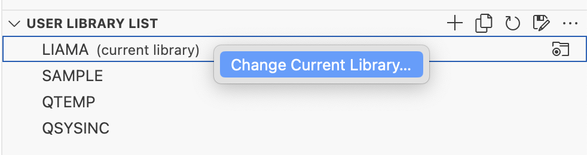

</Card></CardGrid>

<Aside type="note">
If you are following this workshop as part of a hosted lab, a library will be provided to you.
</Aside>

#### 3. Writing the first program

Next, you can create your first program.

<CardGrid>
<Card>

1. Create a directory and give it a name like `src`, or `qrpglesrc`, or whatever name you would like.
2. Create a new file inside of that directory named `mypgm.pgm.rpgle`. We use `.pgm.` for later, as it is an indicator that it is a program.
3. Fill the new file with the source code shown here.

</Card><Card>

```rpgle
**free

dcl-s mytext char(20);

mytext = 'Hello from the world';

dsply mytext;

return;
```

</Card></CardGrid>

#### 4. Deploy and build

Once you have connecting to a system, setup the repo Actions and created your first piece of source code, then it is time to build that source code. From here on out, the dev-test loop is simple: make changes and then build.

To build, from your source code you can either:

1. Use the shortcut: Control + E (Windows/Linux), Command + E (Mac)
2. Find the 'Run Action' button in the editor UI.

The first quickpick is going to show with a list of the Actions as defined in the `actions.json` file. If you correctly selected *RPGLE* when creating the Actions, then **you should see an option for 'Create RPGLE Program'**. Select that, and the deploy and build will commence.

<CardGrid>
<Card>

Following that, another quickpick will show so the user can select which deployment method they want to use. **To keep things simple, use Compare if it shown**.

</Card><Card>


</Card></CardGrid>

Following the choices of Action and deploy method, you can navigate to the Terminal tab to see the command that was submitted, as well as the spool file from the compiler.

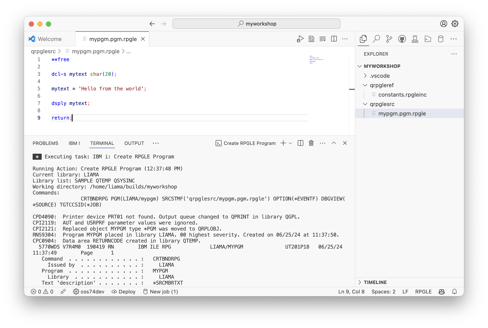

#### 5. Using copybooks / includes

When developing locally, 'member style' includes are no longer used for `/COPY` or `/INCLUDE` statements. Instead, we can use 'posix style' includes, which means using a path relative to the root of the directory.

<CardGrid>
<Card>

1. Create a new directory for copybooks/header files. Usually a name like `qrpgleref`, or `headers`, works.
2. Create a brand new source file in that new directory, named `constants.rpgleinc`, with the content shown here:

</Card><Card>

```rpgle
**free

dcl-c MYLABEL 'Hello from the world';
```

</Card></CardGrid>

<CardGrid>
<Card>

3. Go back to the original source that was created and add a `/copy` or `/include` statement to bring in the new file that was created.
4. Add a reference to the constant that was defined in the included file.

</Card><Card>

```rpgle
**free

/copy 'qrpgleref/constants.rpgleinc'

dcl-s mytext char(20);

mytext = MYLABEL;

dsply mytext;

return;
```

</Card></CardGrid>

5. Recompile your source using the shortcut (Command/Control+E) or the UI.

## Initialising your git repository

<Aside type="note">
Going forward, git is required on your system. See the requirements at the start of this workshop for a list.
</Aside>

Your repositories should have three files at this point:

1. `mypgm.pgm.rpgle`
2. `constants.rpgleinc`
3. `actions.json`

To track this files in git, we need to turn the root directory with these files into a git repository. This can be done in two ways:

1. from the command line: `git init`, or
2. through Visual Studio Code's Source Control view. Switch to that view and select the 'Initialise git repository' and then the view will show the files to be tracked.

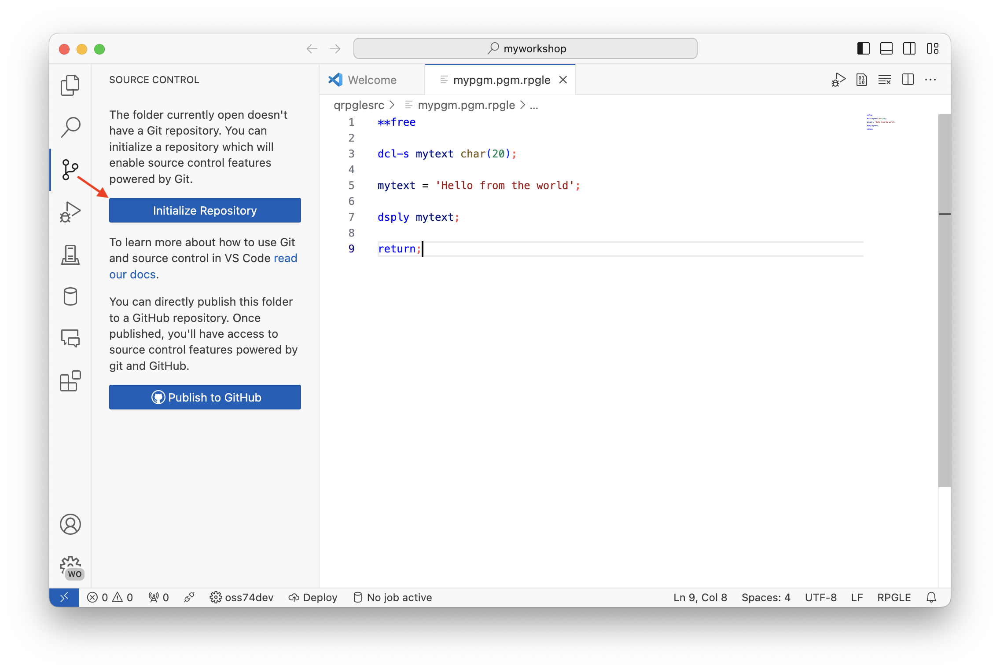

<CardGrid>
<Card>

All new files in the Source Control view have the letter 'A' next to this, which stands for 'Added'. It is 'added' because it is a new file to the git repository. When you hover over the files in the view, you will see a plus (+) icon appear on it (as well as the parent note). **Select the plus (+) on each file to stage the file**.

</Card><Card>

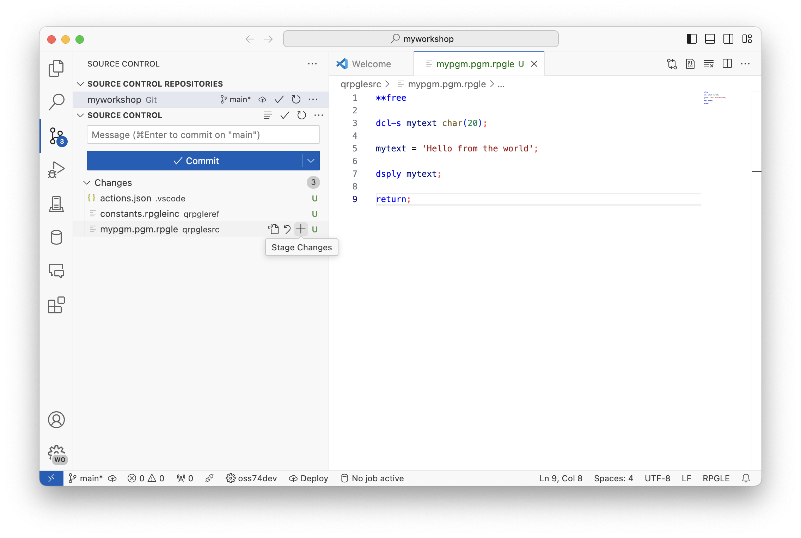

</Card></CardGrid>

When the files are staged, **enter a commit message above and then select 'Commit'**. This will take the staged files, create a commit with the changes and store them into the history of the repository. The list of files will then be empty, since it will show only changes sources in the 'working tree' (e.g. the directory).

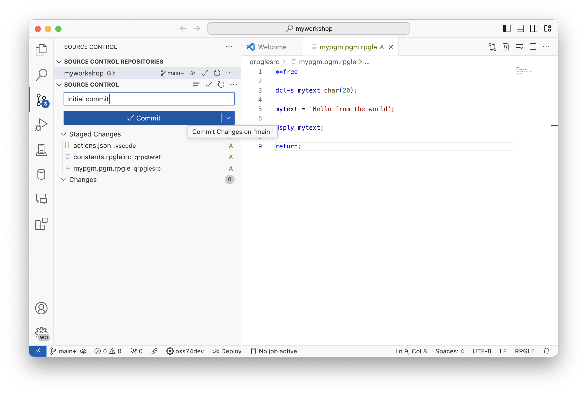

## Making additional changes

Since the repository has been created, any new changes that are made (be it modifications, deletions or new files) will be tracked. The Source Control view will reflect this.

<CardGrid>
<Card>

**Open up the header file and make a change to the `MYLABEL` constant**.

</Card><Card>

```rpgle
**free

dcl-c MYLABEL 'Hello from the lab';
```

</Card></CardGrid>

<CardGrid>
<Card>

After saving the file, the Source Control view will automatically update to show changes in the repository.

</Card><Card>

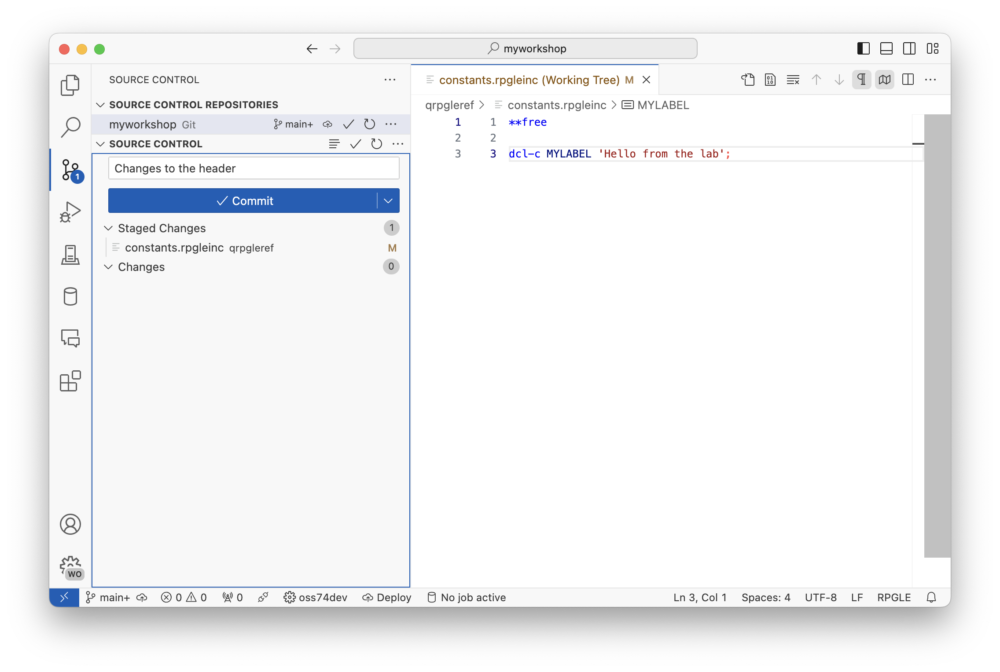

</Card></CardGrid>

Like before, the changed file, now tagged with 'M' (for modified), can be hovered on and will show the plus (+). Clicking on the plus will stage it the file, then a commit message can be provided before clicking on the 'Commit' button.

<Aside type="tip">
You can optionally recompile your program source to see the change in the program.
</Aside>

---

## Making a GitHub repository

<Aside type="note">
Going forward, a free GitHub account is required. Please see the requirements for the signup link.
</Aside>

Using git on your local machine is great for when you are developing. But, when you are working in a team, it's useful to have collaborations tools so code can be shared and worked on by other people. For the purpose of this workshop, we will be creating a repository in GitHub. There are also plenty of other services, such as GitLab, or Azure DevOps.

### Tasks

#### 1. Publish to GitHub

<CardGrid>
<Card>

When you have no unstaged or staged changes, the Commit button should turn into the Publish button. Clicking the Publish button should show a popup asking you to sign in to GitHub.

</Card><Card>

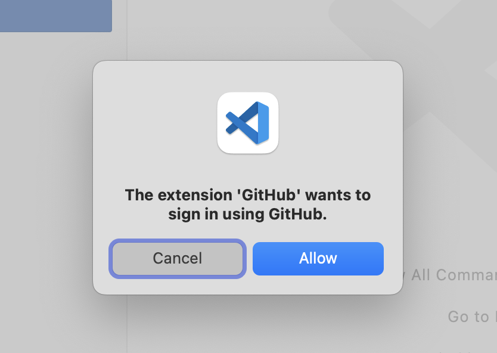

</Card></CardGrid>

<CardGrid>
<Card>

That will take you to GitHub to sign in, and eventually, in your browser, a popup will show asking if you'd like to navigate back to Visual Studio Code. **Be sure to Allow this**.

</Card><Card>

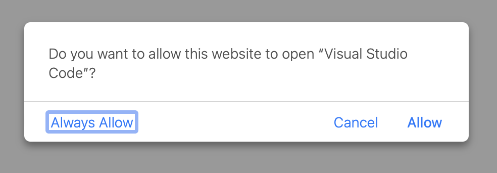

</Card></CardGrid>

<CardGrid>
<Card>

Lastly, it will ask if you want to make this a public or private repository on your GitHub account. Select either, and then it will automatically publish and connect to the remote repository.

</Card><Card>


</Card></CardGrid>

Navigating to your GitHub profile will show the repository and all the history for anyone who has access to see.

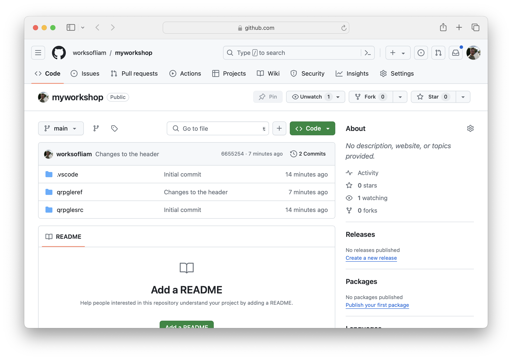

<Aside type="tip">
If you're feeling daring, give someone else access to your repo and let them do the next section against your repository. You can grant access to other GitHub users by heading to the Settings tab in your repository, and then adding them under the Collaborators tab.
</Aside>

---

## Cloning repositories

<Aside type="caution">
For the future parts of this workshop, you need to ensure your repository was published to GitHub. If it has not, do not continue onward.
</Aside>

To show that files and history is stored in git, we are going to delete the local directory/repository and then clone it again. You will use this cloning mechanism when working on other projects too.

### Tasks

#### 1. Delete the local directory

Completely close Visual Studio Code and then delete the folder through either:

1. the system explorer of the OS you are using
2. through the command like: `rm -rf myworkshop`

#### 2. Clone the repository

<CardGrid>
<Card>

Reopen Visual Studio Code, **open the Command Palette** (F1 or Control/Command+Shift+P) and **search for 'Git: Clone'**. After selecting that option, **select 'Clone from GitHub'** in the new list.

</Card><Card>

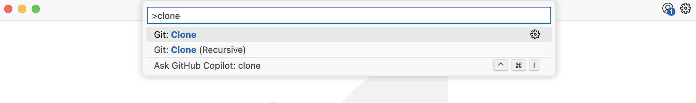


</Card></CardGrid>

<CardGrid>
<Card>

The next list will allow you to search and find repositories on GitHub to clone. You can enter in your GitHub username, followed by a forward-slash, then your repo name to find the repository you published. (`youruser/yourrepo`).

It may ask where you would like to clone the repository to, in which you can select a location that suits you.

</Card><Card>


</Card></CardGrid>

Lastly, it will ask how you want to open the repository. Selecting any option is okay.

<Aside type="tip">
Now you have cloned the repository, the development flow can start again after you have connected to a system: edit, compile, test.
</Aside>

---

## Creating branches and PRs

Typically development is not done in the branch that is initially created (which is typically called `main`). Instead, you would create a new branch, where changes would be made, and before they are merged back in, they can be reviewed. Code reviews will be covered in the next part.

If you are new to the concept of branching, [check out this guide from Atlassian](https://www.atlassian.com/git/tutorials/using-branches).

### Tasks

#### 1. Create a new branch

<CardGrid>
<Card>

To create a branch:

1. **select the current branch name in the bottom left corner** of VS Code (in the screenshot, it is showing `main` as the current branch)
2. when the quickpick appears, select 'Create new branch...', and then **enter in a branch name**; something like `mynewbranch` or `somethingrandom`.

</Card><Card>


</Card></CardGrid>

<Aside type="tip">
You can also use the quickpick view to change to other branches made by other people!
</Aside>

#### 2. Make new commits

You should see the branch name change in the bottom left corner of VS Code to the branch you created (the screenshot shows `mynewbranch`).

<CardGrid>
<Card>

1. For your next commit, you can **simply make a change to the constant in the header file**. Then, Source Control view will update with the change you make.
2. When you've reviewed your changes, entered a commit message, you can **click 'Commit' to commit code** to this branch.

</Card><Card>


</Card></CardGrid>

<Aside type="tip">
Typically, you would do the dev/test/compile loop before making a commit to ensure the code is correct. It's not good practice to commit code that has not been tested.
</Aside>

#### 3. Publish the branch

Publishing the branch means moving the branch and commits from your local device to the remote repository so others can have access to it.

<CardGrid>
<Card>

When you have no unstaged or staged changes, the Commit button should turn into the Publish button. **Clicking the Publish** button should copy your branch to the remote repository.

</Card><Card>


</Card></CardGrid>

#### 4. Create a Pull Request

<CardGrid>
<Card>

Head over to your repository on GitHub, and you should see a notice appear above all else displaying that a push has been made to a new branch.

Click the 'Compare & pull request' button to start the PR creation process.

</Card><Card>

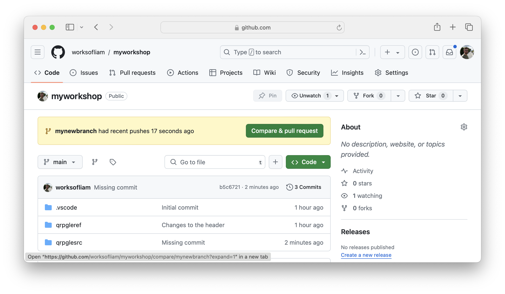

</Card></CardGrid>

<CardGrid>
<Card>

This will take you to another page where the code changes can be reviewed, plus a title and description of the changes can be provided.

When the title and description has been provided, you can click the 'Create pull request' button.

</Card><Card>


</Card></CardGrid>

#### 5. Review and merge

Typically, when the PR has been created, this is time for one or more people to review the changes you have made. They might pull and checkout the branch on their own device, and then compile the changes manually, and check that everything works as expected. You can see in the UI, you can do a number of things:

* view the commits made to this branch
* review the changed code and leave comments of specific lines of code
* request other people to review the PR
* leave general comments
* request further changes or approve and merge the PR

Since no one else will be reviewing your Pull Request, you can merge by clicking on the 'Merge pull request' button.

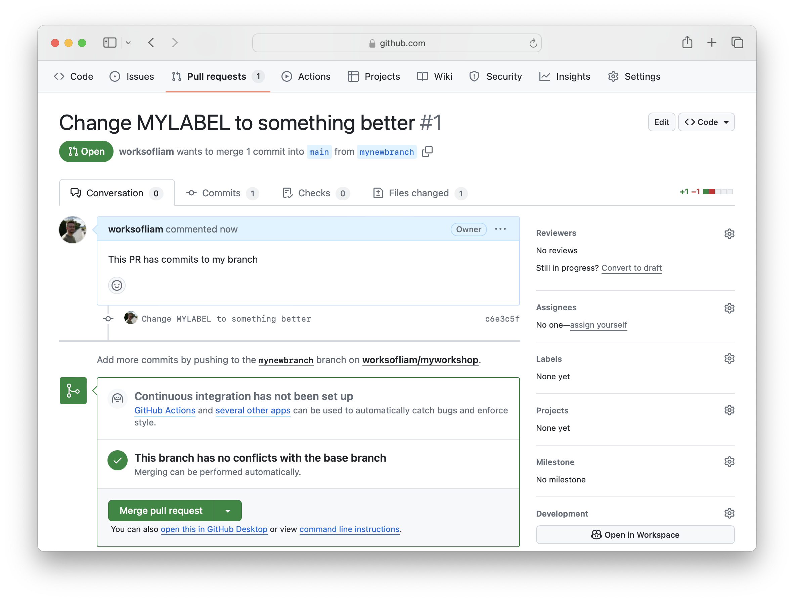

When the merge happens, the commits will be copied from this branch into the branch where the current was branched from. In this instance, `mynewbranch` was created from `main`, so therefore, the commits will be copied back into `main`. **This only happens on the remote repository. Developers will need to pull the commits down to the local device after the merge**.

#### 6. Update your local repo

<CardGrid>
<Card>

Like when creating a new branch, select on the current branch name in the lower left corner of VS Code (the screenshot showing `mynewbranch`), and then select `main` in the quickpick to checkout to `main`.

</Card><Card>

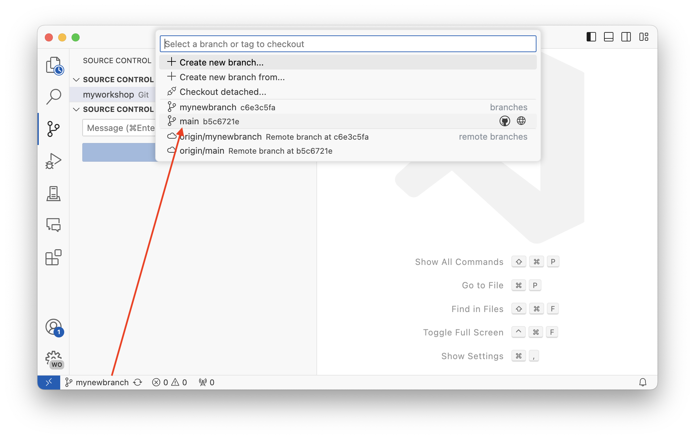

</Card></CardGrid>

<CardGrid>
<Card>

You won't have the changes from the merge until you do a 'pull'. A *pull* simply means pulling commits and branches from the remote repo to your local cloned repo. Visual Studio Code has a 'sync' button next to the branch selection button. Clicking this will both push and pull changes against the remote repo.

After syncing, you will have all the missing changes on your local device.

</Card><Card>

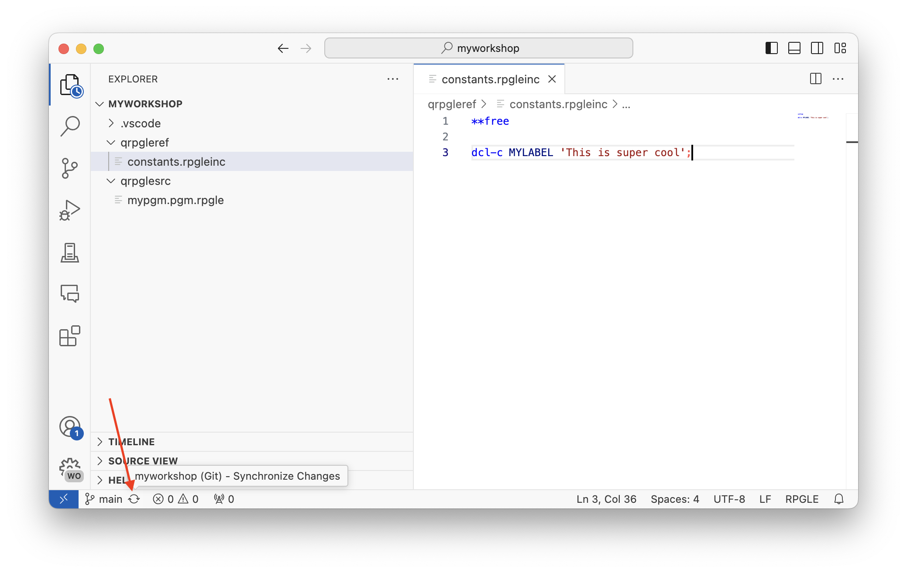

</Card></CardGrid>