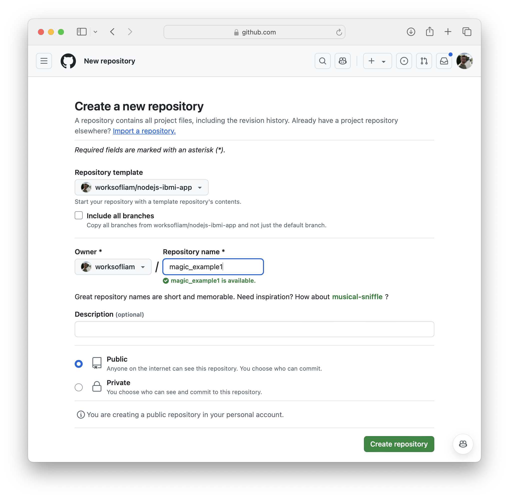
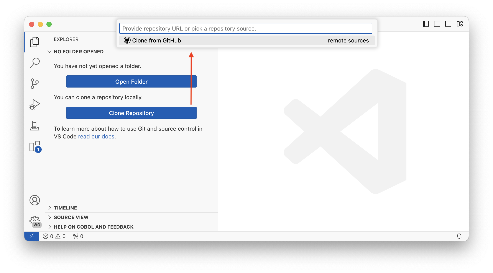
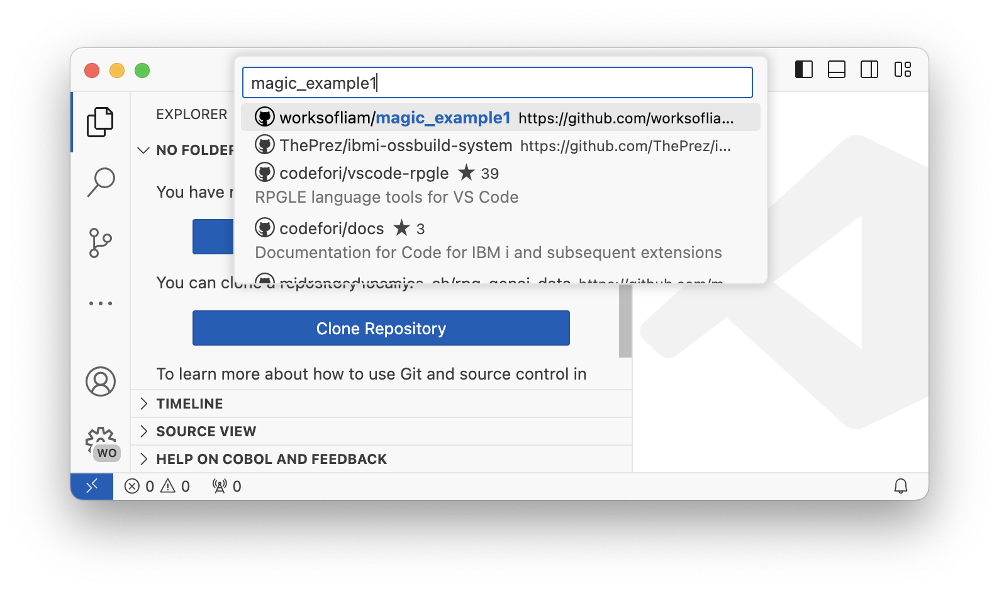
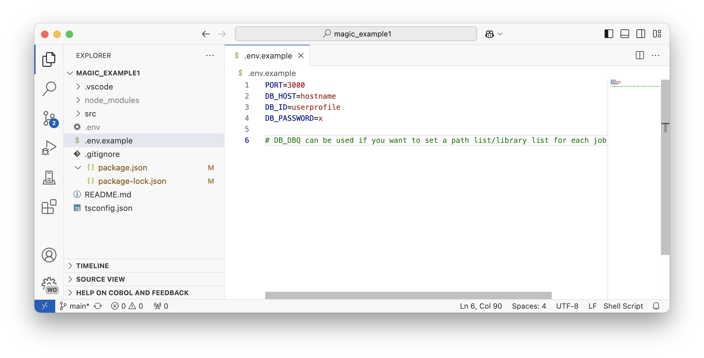
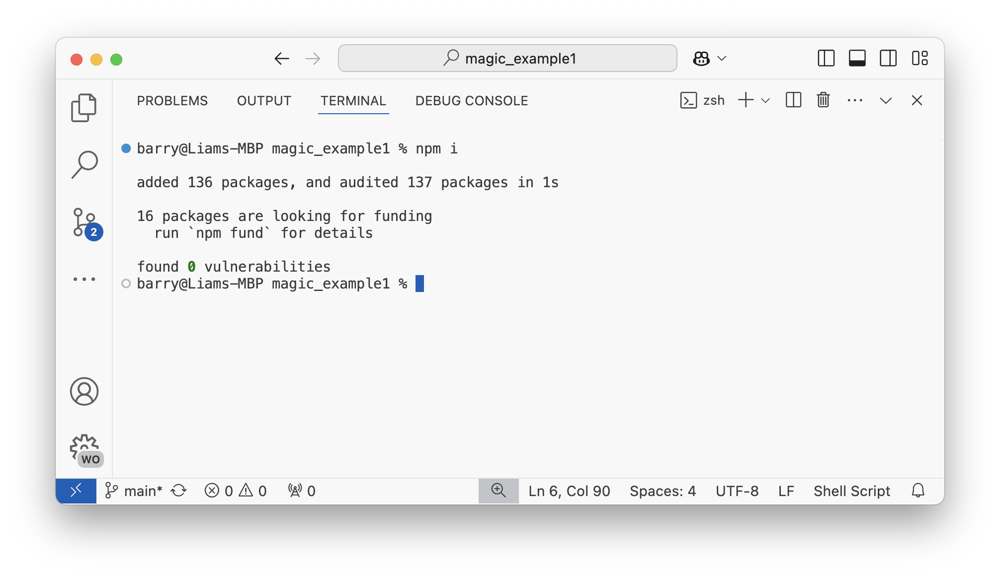
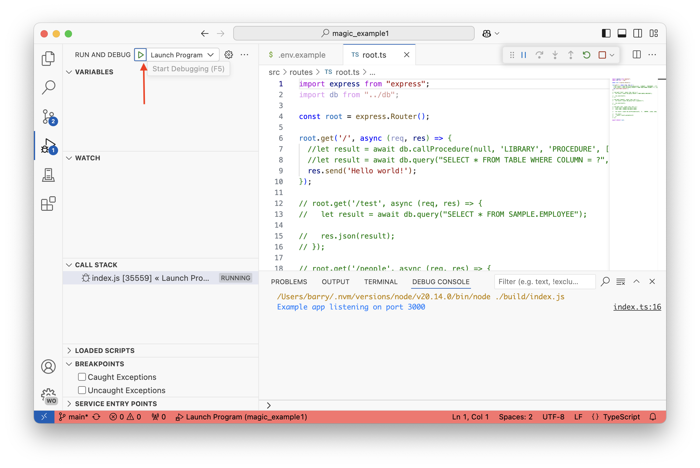
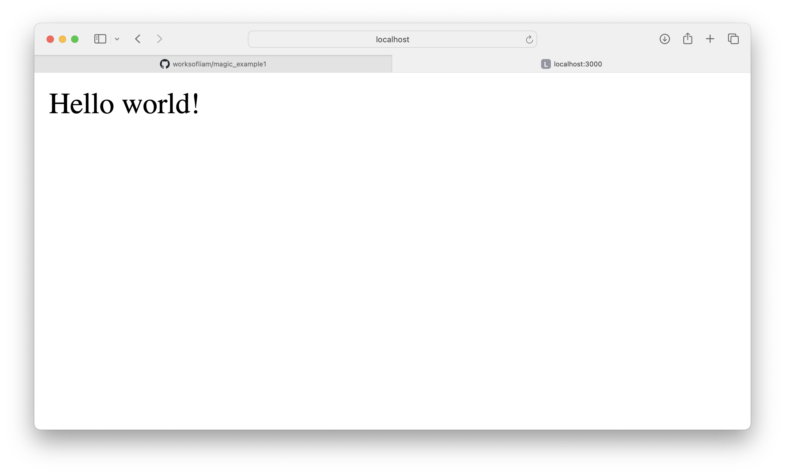
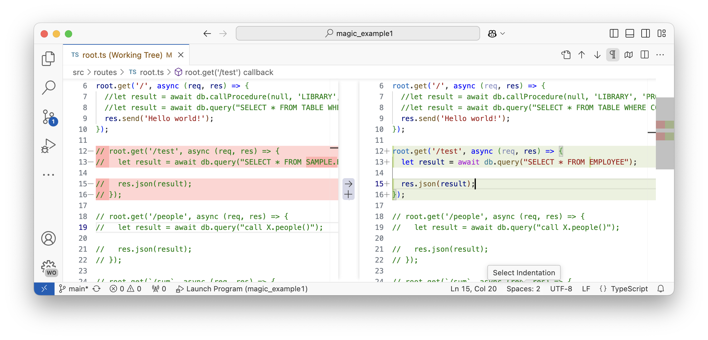
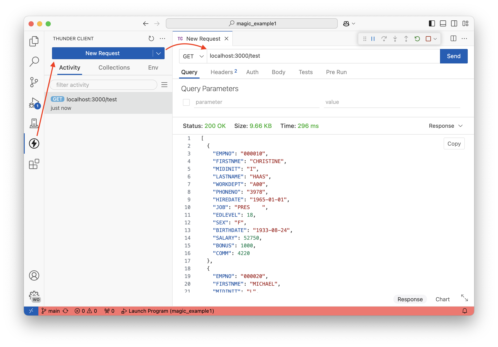

import { Aside, CardGrid, Card } from '@astrojs/starlight/components';

## Outline

1. Requirements
2. Goals
3. Getting and running the template
4. Building your first route

---

## Requirements

This is a BYOD (bring your own device) workshop and some software and accounts are required.

### Tasks

#### Install Node.js

You can install Node.js from either:

1. [The Node.js website](https://nodejs.org/en)
2. [Through the nvm client](https://github.com/nvm-sh/nvm/blob/master/README.md#installing-and-updating)

#### Install git

* If you're on Mac, git is shipped with the installation of Xcode. If you don't have Xcode, it can be installed [though brew](https://git-scm.com/download/mac).
* If you are on Windows, you may need to install git if you do not have it. [Check out the git website for installing git on Windows](https://git-scm.com/download/win).

#### Signup to GitHub

If you don't have a GitHub account, you are going to need one for this workshop. We will be creating new repositories and working with others.

[Sign up here](http://github.com/signup).

#### Install Visual Studio Code

We are using VS Code to write our code. It is a free, open-source editor with great extensibility.

[Download it here for free](https://code.visualstudio.com/download).

#### Install Code for IBM i (optional)

**After you have installed Visual Studio Code**, then go ahead and install the [Code for IBM i extension](https://marketplace.visualstudio.com/items?itemName=HalcyonTechLtd.code-for-ibmi), or, to make life easier in the future, install the [IBM i Development pack](https://marketplace.visualstudio.com/items?itemName=HalcyonTechLtd.ibm-i-development-pack).

#### Install Thunder Client (optional)

**After you have installed Visual Studio Code**, then go ahead and install the [Thunder Client extension](https://marketplace.visualstudio.com/items?itemName=rangav.vscode-thunder-client). This will allow you to test your APIs from within VS Code.

#### Access to an IBM i

If you are doing this workshop as part of a hosted lab, then a user profile and system will be provided to you. If you're using your own system, then ensure SSH is running on your system. [Check out the requirements](../../).

---

## Goals

The main goal of this workshop is to understand how APIs are created with Node.js. We will create routes that do CRUD against a Db2 for IBM i database.

### Understanding Local Development

For the workshop, we are going to develop a Node.js/TypeScript application on your local machine. A standard way to develop Node.js apps if to develop locally, or in a container first, before then deploying to another server (like IBM i).

---

## Getting and running the template

A Node.js API template, built specifically for using TypeScript, creating APIs with express, and using ODBC to connect to IBM i, is provided as part of this lab.

[Access the template here](https://github.com/worksofliam/nodejs-ibmi-app), **but please setup your GitHub account so the template can be copied**.

### Create the repo from the template

Select 'Use this template' and 'Create a new repository'. Fill out your new repository information and when it has been created, clone it to your local device.

Ether use the same name as the template, or give it your own unique name. Either way, press 'Create Repository'

### Clone the repository in VS Code

<CardGrid><Card>

The next step is to clone your template onto your local machine. The easiest way is to do this through Visual Studio Code. In the Source Control view, there is a 'Clone repository' button, in which you can lookup a repository. Select (or use Enter) 'Clone from GitHub'.

<Aside type="note">
VS Code may as if you want to sign in with GitHub. Make sure that you do to make this easier for you!
</Aside>

</Card><Card>

</Card></CardGrid>

<CardGrid><Card>

In the new quickpick, enter your GitHub username, followed by a slash, and the name of the template repository you created.

After you select your repository, it will ask if you want to 'Open' or 'Open in new window'. Either works ok!

</Card><Card>

</Card></CardGrid>

### Create the `.env` file

For the purpose of development, we are going to use a `.env` file to store credentials to access the database. This file is not committed to the repository, so it is safe to store sensitive information in it.

<CardGrid><Card>

Create a copy of `.env.sample` and rename it to `.env`. This file is in the root of the project.

Replace the values in the `.env` file with your own IBM i credentials. If you're taking this as part of a pre-built lab, then the credentials will be provided to you.

</Card><Card>

</Card></CardGrid>

### Install the dependencies

The next step is to install the dependencies. Open a terminal in VS Code and run `npm install` (or `npm i` for short!). Use Control + ` (backtick) to open the terminal.

<Aside type="note">
If your application doesn't start up, it usually means the app failed to connect to the database. Check the `.env` file and ensure the credentials are correct.
</Aside>

### Start debugging

The template comes with a launch configuration for debugging. Press F5 to start the debugger, or select the 'Run and Debug' button in the sidebar as shown in the screenshot. This will start the application and attach the debugger to it.

<Aside type="note">
Remembering how to start the debugger is important, as we will be using it a lot in this workshop.
</Aside>

You can access the site by using `localhost`, followed by the port number (`PORT` variable) defined in the `.env` file.

<Aside type="note">
The source for the root route (`localhost:3000/`) is in `src/routes/index.ts`. This is the first file we will be working with in the next section.
</Aside>

## Building your first route

### Enable the test route

To test that we have a valid database connection, we can uncomment the test route in `src/routes/index.ts`. This route will execute a simple select statement against the database and return the results.

### Debugging the route

To test the route, we can use the debugger. Start the debugger as we did earlier, and then open a browser to `localhost:3000/test`. This will hit the route and return the results. You can also use Thunder Client to test the route. Under the Thunder Client view, use the 'New Request' button, which opens a brand new tab where you can enter the address you are testing.

