import { Aside, CardGrid, Card } from '@astrojs/starlight/components';

## Outline

1. Requirements
2. Goals
3. Getting and running the template
4. Building your first route
5. Understanding our API
6. Building the first route

---

## Requirements

This is a BYOD (bring your own device) workshop and some software and accounts are required.

### Tasks

#### Install Node.js

You can install Node.js from either:

1. [The Node.js website](https://nodejs.org/en)
2. [Through the nvm client](https://github.com/nvm-sh/nvm/blob/master/README.md#installing-and-updating)

#### Install git

* If you're on Mac, git is shipped with the installation of Xcode. If you don't have Xcode, it can be installed [though brew](https://git-scm.com/download/mac).
* If you are on Windows, you may need to install git if you do not have it. [Check out the git website for installing git on Windows](https://git-scm.com/download/win).

#### Signup to GitHub

If you don't have a GitHub account, you are going to need one for this workshop. We will be creating new repositories and working with others.

[Sign up here](http://github.com/signup).

#### Install Visual Studio Code

We are using VS Code to write our code. It is a free, open-source editor with great extensibility.

[Download it here for free](https://code.visualstudio.com/download).

#### Install Code for IBM i (optional)

**After you have installed Visual Studio Code**, then go ahead and install the [Code for IBM i extension](https://marketplace.visualstudio.com/items?itemName=HalcyonTechLtd.code-for-ibmi), or, to make life easier in the future, install the [IBM i Development pack](https://marketplace.visualstudio.com/items?itemName=HalcyonTechLtd.ibm-i-development-pack).

#### Install Thunder Client (optional)

**After you have installed Visual Studio Code**, then go ahead and install the [Thunder Client extension](https://marketplace.visualstudio.com/items?itemName=rangav.vscode-thunder-client). This will allow you to test your APIs from within VS Code.

#### Access to an IBM i

If you are doing this workshop as part of a hosted lab, then a user profile and system will be provided to you. If you're using your own system, then ensure SSH is running on your system. [Check out the requirements](../../).

---

## Goals

The main goal of this workshop is to understand how APIs are created with Node.js. We will create routes that do CRUD against a Db2 for IBM i database.

### Understanding Local Development

For the workshop, we are going to develop a Node.js/TypeScript application on your local machine. A standard way to develop Node.js apps if to develop locally, or in a container first, before then deploying to another server (like IBM i).

---

## Getting and running the template

A Node.js API template, built specifically for using TypeScript, creating APIs with express, and using ODBC to connect to IBM i, is provided as part of this lab.

[Access the template here](https://github.com/worksofliam/nodejs-ibmi-app), **but please setup your GitHub account so the template can be copied**.

### Create the repo from the template

Select 'Use this template' and 'Create a new repository'. Fill out your new repository information and when it has been created, clone it to your local device.


Ether use the same name as the template, or give it your own unique name. Either way, press 'Create Repository'


### Clone the repository in VS Code

<CardGrid><Card>

The next step is to clone your template onto your local machine. The easiest way is to do this through Visual Studio Code. In the Source Control view, there is a 'Clone repository' button, in which you can lookup a repository. Select (or use Enter) 'Clone from GitHub'.

<Aside type="note">
VS Code may as if you want to sign in with GitHub. Make sure that you do to make this easier for you!
</Aside>

</Card><Card>


</Card></CardGrid>

<CardGrid><Card>

In the new quickpick, enter your GitHub username, followed by a slash, and the name of the template repository you created.

After you select your repository, it will ask if you want to 'Open' or 'Open in new window'. Either works ok!

</Card><Card>


</Card></CardGrid>

### Create the `.env` file

For the purpose of development, we are going to use a `.env` file to store credentials to access the database. This file is not committed to the repository, so it is safe to store sensitive information in it.

<CardGrid><Card>

Create a copy of `.env.sample` and rename it to `.env`. This file is in the root of the project.

Replace the values in the `.env` file with your own IBM i credentials. If you're taking this as part of a pre-built lab, then the credentials will be provided to you.

</Card><Card>


</Card></CardGrid>

### Install the dependencies

The next step is to install the dependencies. Open a terminal in VS Code and run `npm install` (or `npm i` for short!). Use Control + ` (backtick) to open the terminal.


<Aside type="note">
If your application doesn't start up, it usually means the app failed to connect to the database. Check the `.env` file and ensure the credentials are correct.
</Aside>

### Start debugging

The template comes with a launch configuration for debugging. Press F5 to start the debugger, or select the 'Run and Debug' button in the sidebar as shown in the screenshot. This will start the application and attach the debugger to it.


<Aside type="note">
Remembering how to start the debugger is important, as we will be using it a lot in this workshop.
</Aside>

You can access the site by using `localhost`, followed by the port number (`PORT` variable) defined in the `.env` file.


<Aside type="note">
The source for the root route (`localhost:3000/`) is in `src/routes/index.ts`. This is the first file we will be working with in the next section.
</Aside>

## Building your first route

### Enable the test route

To test that we have a valid database connection, we can uncomment the test route in `src/routes/index.ts`. This route will execute a simple select statement against the database and return the results.


### Debugging the route

To test the route, we can use the debugger. Start the debugger as we did earlier, and then open a browser to `localhost:3000/test`. This will hit the route and return the results. You can also use Thunder Client to test the route. Under the Thunder Client view, use the 'New Request' button, which opens a brand new tab where you can enter the address you are testing.


## Understanding our API

For the remainder of the lab, we are going to build an API according to a specification. [We defined the specification inside of this gist](https://gist.github.com/worksofliam/600cddab687bdd127c7b8e1dfd456cde). At a first glance, it's a big, ugly, YAML document, but it's actually quite simple.

This YAML document is a specification for an API. It defines the routes, the methods, and the responses that are expected. This is a common way to define APIs, and it's called OpenAPI. Sometimes you may hear it called Swagger, but that's just a brand name for the same thing.

### Visualising the APIs

To visualise the APIs, we are going to use a tool called Swagger UI. This is a web-based tool that reads the OpenAPI specification and displays it in a nice, human-readable format.

Head over to the [classic Swagger Editor here](https://editor.swagger.io/), and then paste the gist provided above.

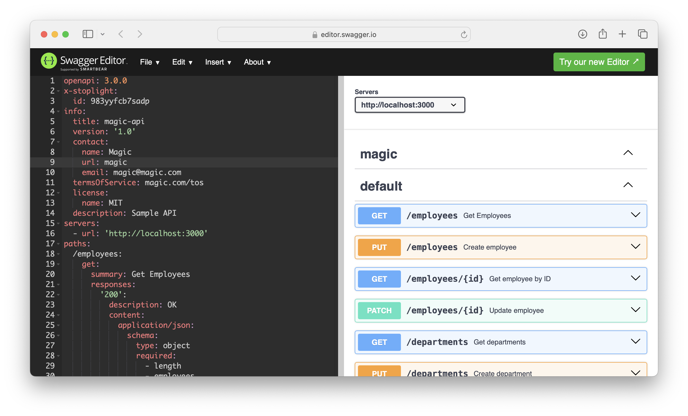

As you can see from the screenshot, we have a few routes defined. We are going to build these routes in the next section.

## Building the first route (employees)

Here we are going to build the first route, namely `/employees`. This route will allow many things: listing, updating and creating (i.e. CRUD) employee in our database.

### Adding the new route

We need to do two things:

<CardGrid><Card>

Create a new file, `src/routes/employees.ts`, with the following content:

```typescript
import express from "express";
import db from "../db";

const root = express.Router();

// APIs will be defined here.

root.get("/", (req, res) => {
  res.send("Hello World!");
});

export default root;
```

</Card><Card>

Update `src/index.ts` to include the new route:

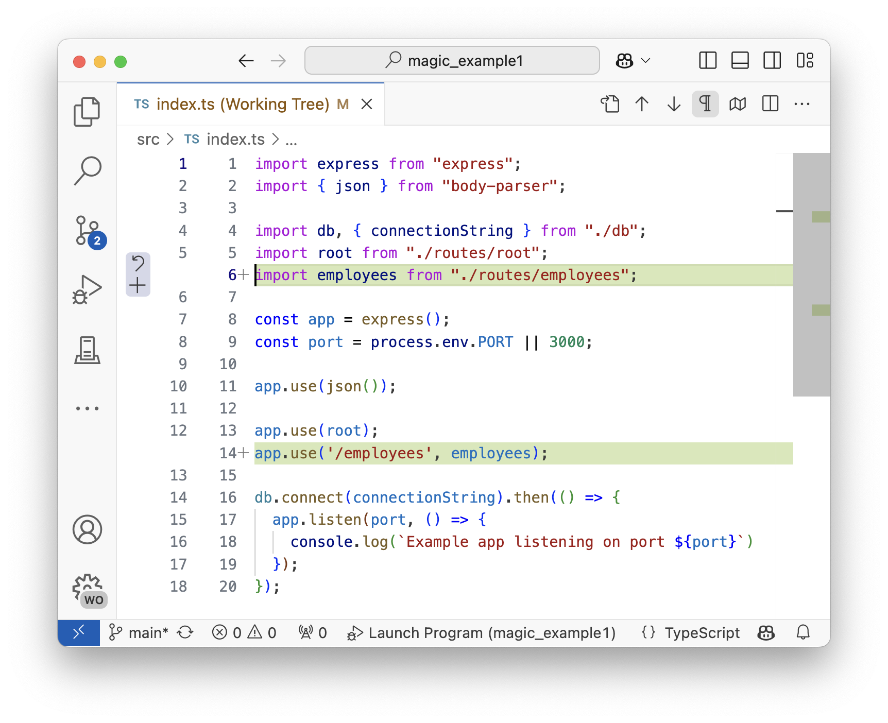

</Card></CardGrid>

Anything route defined in this new `employees.ts` file will be prefixed with `/employees`. For example, we defined a route `/`, then it will be `/employees/`.

### Testing the route

To test the route, we can use the debugger. Start the debugger as we did earlier, and then open a browser to `localhost:3000/employees` (or use Thunder Client). This will hit the route and return the results.

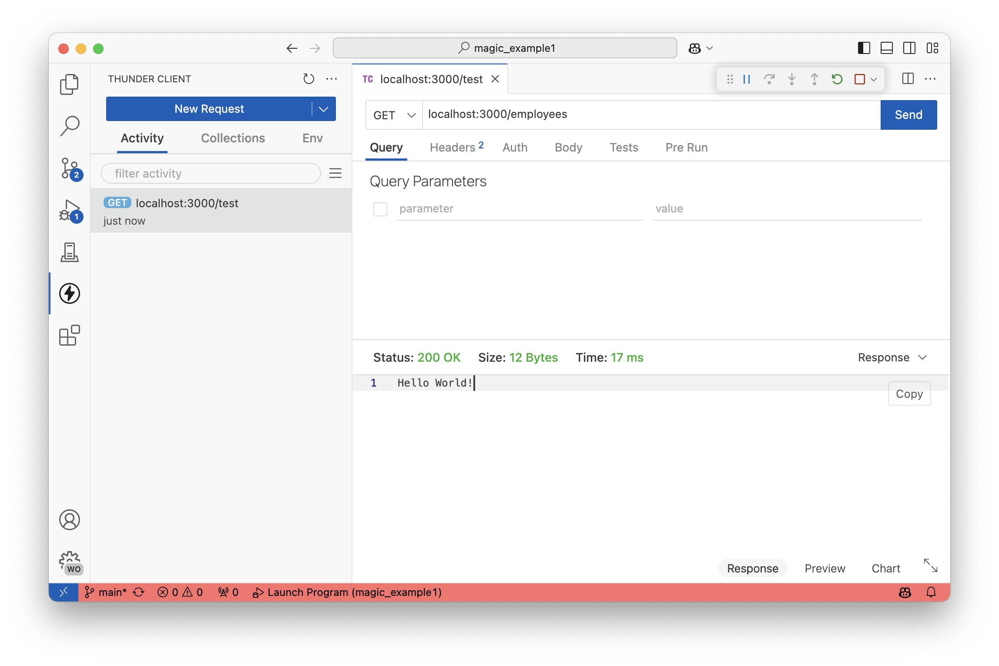

### Matching the specificiation

The specification defines that the route `/employees` should return a list of employees. We can do this by querying the database and returning the results. But, we need to make sure that the results are in the correct format - an array of objects with specific key names.

If you expand 'GET /employees' in the Swagger Editor, you can see from the example response that it should return an array of objects with specific keys. We need to make sure that our route returns this format. Let's start by building an SQL statement that matches the `employees` array.

<CardGrid><Card>

```json
{
  "length": 0,
  "employees": [
    {
      "id": "string",
      "first": "string",
      "last": "string",
      "job": "string",
      "workdept": "str",
      "salary": 1
    }
  ]
}
```

</Card><Card>

```sql
select 
    empno as "id",
    firstnme as "first",
    lastname as "last",
    job as "job",
    workdept as "workdept",
    salary as "salary"
from employee;
```

We use correlation names to match the keys in the JSON object since Db2 for i columns are uppercase by default.

</Card></CardGrid>

When we run this SQL statement, we will get an array of objects that match the specification. We can then return this array in the response.

Let's update the root route in `src/routes/employees.ts` to execute and return the result set of this statement.

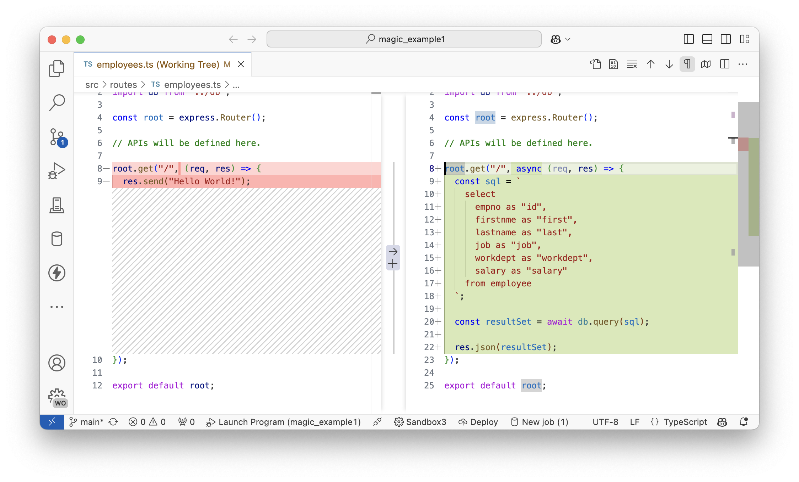

We can test the route by calling `localhost:3000/employees` in the browser or Thunder Client.

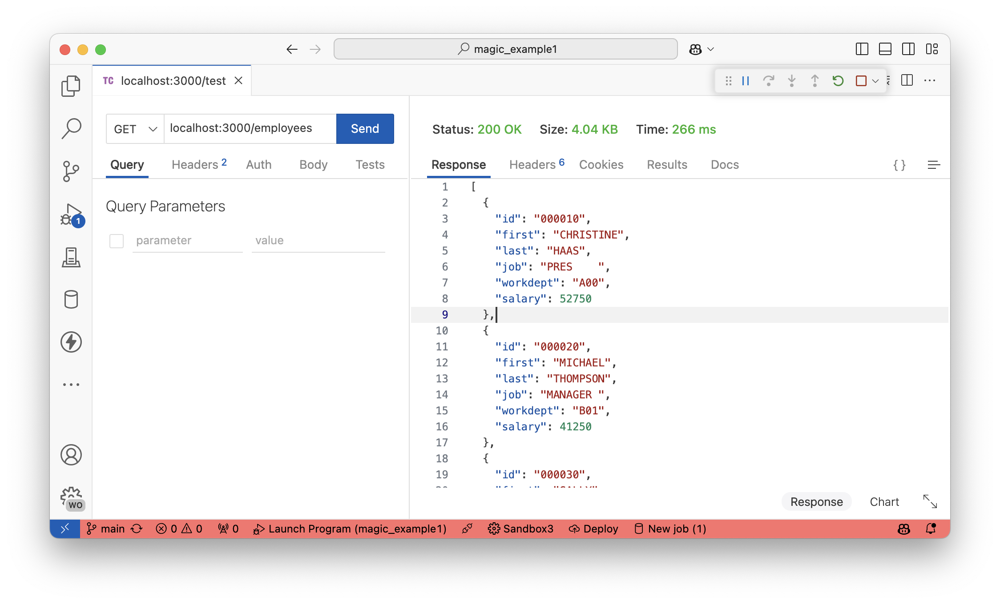

But, notice that our result JSON doesn't match the specification. We still need to add the `length` key to the response. We can do this by wrapping the result set in an object that contains the `length` key.

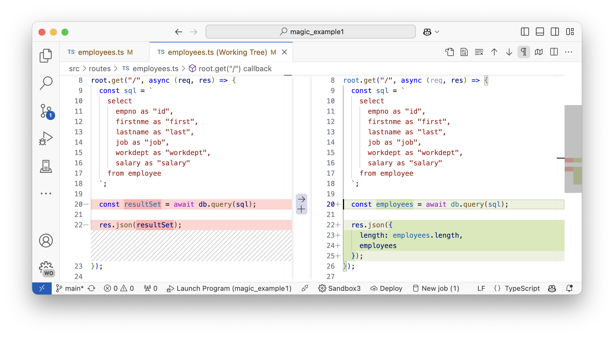

Now, when we test the route, we should see the correct response.

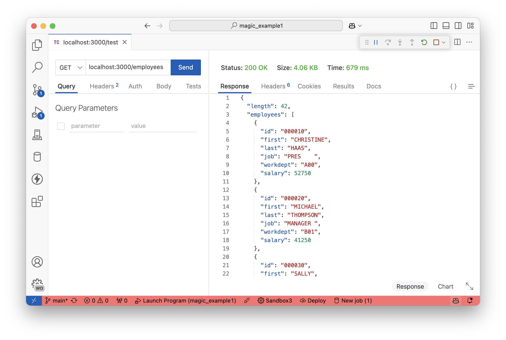

## Building a second route (departments)

Much like when we built the `/employees` route, we are now going to do the same with `/departments`. This route will allow us to list, update and create departments in our database.

### Adding the new route

Let's start by doing two things:

<CardGrid><Card>

Create a new file, `src/routes/departments.ts`, with the following content:

```typescript
import express from "express";
import db from "../db";

const root = express.Router();

root.get("/", async (req, res) => {
  const sql = `
    select 
      deptno as "id",
      deptname as "name",
      location as "location",
      mgrno as "manager"
    from department
  `;

  const departments = await db.query(sql);

  res.json({
    length: departments.length,
    departments
  });
});

export default root;
```

</Card><Card>

Update `src/index.ts` to include the new route:

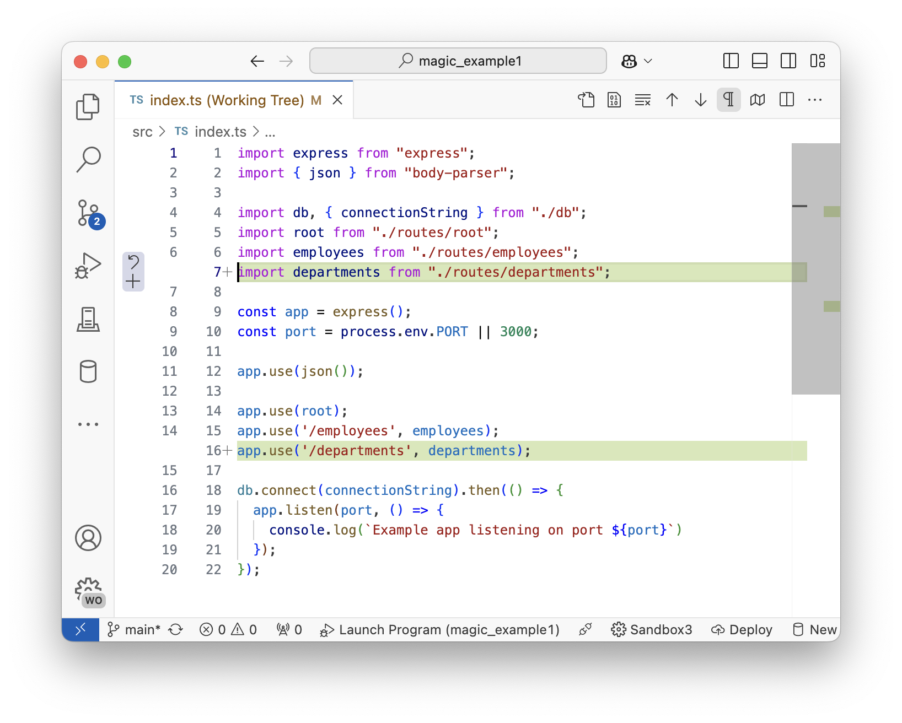

</Card></CardGrid>

Note that in the `/departments` result set, we already created it to match the 'GET /departments' specification. We can test the route by calling `localhost:3000/departments` in the browser or Thunder Client.

### Calling an RPGLE program (optional)

If you took part in the Git and RPGLE workshop and created the `DEPTS` SQL RPGLE program, then you know that the program returns an SQL result set. We can call this program from our Node.js application and return the result set too! Simply replace the `select` statement with a `call` to the program.

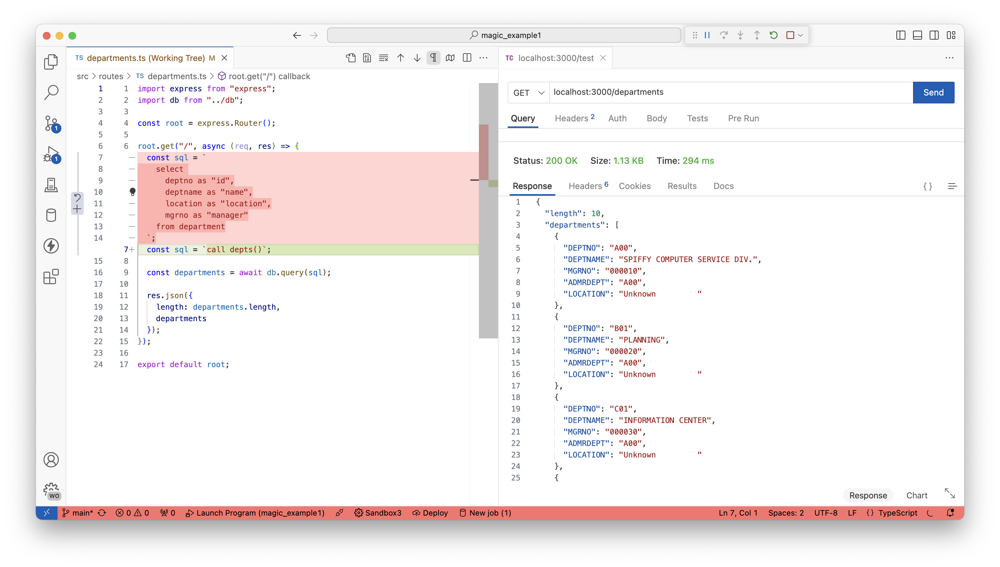

If you compare the programs result set to the required output of 'GET /departments' in the Swagger Editor, you will see that they do not match. The columns from the program are incorrect. Here is a challenge for you, either:

1. Update the program to return the correct columns. (recommended method!)
2. Update the TypeScript code to map the columns to the correct keys. (Perhaps `departments.map(...)` will do the trick, but slower!)

### Getting a specific row/record

The specification also defines that we should be able to get a specific department by its ID. We can do this by adding a new route to the `/departments` route. This route will take a parameter, the department ID, and return the department with that ID.

<CardGrid><Card>

Add the following route to `src/routes/departments.ts`, below the root (`/`) route.

This route will take a parameter, `id`, and return the department with that ID.

If the department is not found, we will return a 404 status code.

</Card><Card>

```typescript
root.get("/:id", async (req, res) => {
  const sql = `
    select 
      deptno as "id",
      deptname as "name",
      location as "location",
      mgrno as "manager"
    from department
    where deptno = ?
  `;

  const department = await db.query(sql, [req.params.id]);

  if (department.length === 1) {
    res.json({department: department[0]});
  } else {
    res.status(404).json({ error: "Department not found" });
  }
});
```

</Card></CardGrid>

Now we have two routes in the `/departments` route:

* `/` - Returns all departments
* `/:id` - Returns a specific department, where ID is the department number

We can test the new route by calling `localhost:3000/departments` in the browser or Thunder Client, and then `localhost:3000/departments/xxx` where `xxx` is a department number.

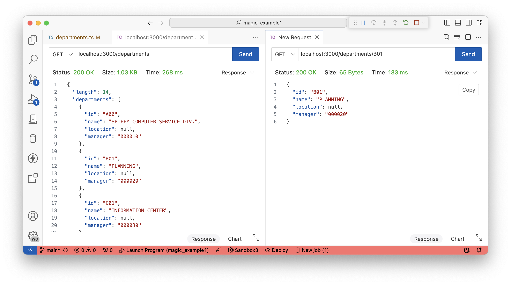

<Aside type="note">
Make sure the resulting object matches the specification in the Swagger Editor.
</Aside>

## Building a PATCH route

The specification defines that we should be able to update a department. We can do this by adding a new route to the `/departments` route. This route will take a parameter, the department ID, a body with properties to update.

### Adding the patch route

Below is the patch route which can be used to update specific departments.

```typescript
root.patch("/:id", async (req, res) => {
  const body = req.body;
  const deptId = req.params.id;
  const inputDepartment = body.department;
  const mappedColumns: {[id: string]: string} = {
    name: "deptname",
    location: "location",
    manager: "mgrno"
  }

  // 1. Basic validation
  if (!inputDepartment || !deptId) {
    res.status(400).json({ error: "Department object and ID is required" });
    return;
  }

  // 2. Map the input object to the columns in the database
  let columnsToUpdate: {[column: string]: string} = {};
  for (const key in inputDepartment) {
    if (mappedColumns[key]) {
      columnsToUpdate[mappedColumns[key]] = inputDepartment[key];
    }
  }

  // Update the table
  const sql = `
    update department
    set ${Object.keys(columnsToUpdate).map(column => `${column} = ?`).join(", ")}
    where deptno = ?
  `;
  await db.query(sql, [...Object.values(columnsToUpdate), deptId]);

  // Get the updated department
  const updatedDepartment = await db.query(`
    select 
      deptno as "id",
      deptname as "name",
      location as "location",
      mgrno as "manager"
    from department
    where deptno = ?
  `, [deptId]);

  if (updatedDepartment.length === 1) {
    res.json({department: updatedDepartment[0]});
  } else {
    res.status(404).json({ error: "Department not found" });
  }
});
```

There is a lot of logic happening in this code.

1. We validate that the request has a body and a department ID.
2. We map the input object to the columns in the database.
3. We update the table with the new values.
4. We get the updated department and return it.

This new route can only be called with a `PATCH` request, which means we cannot test this in the browser very easily. We can test the new route by calling `localhost:3000/departments/xxx` in Thunder Client, with a `PATCH` request and a body with the properties to update.

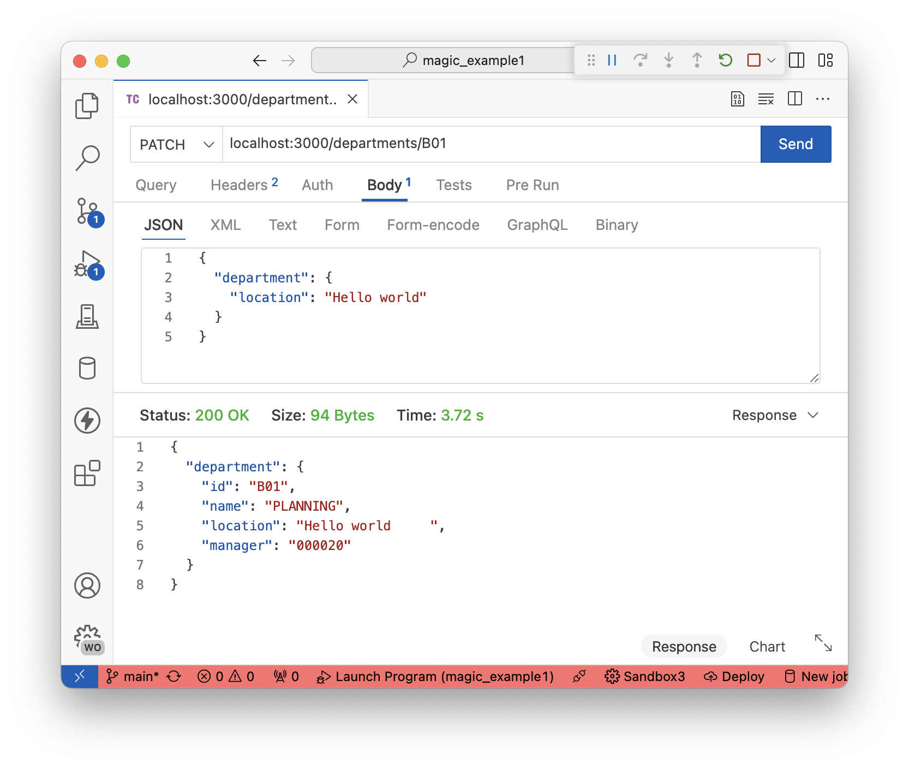

<Aside type="note">
There are lot of issues with the PATCH code. For example, we are not validating the input, we are not handling errors, and we are not returning the correct status codes. This is a good exercise to improve the code.
</Aside>

## Adding the OpenAPI validator

We have built the routes according to the specification, but we have not validated that the routes match the specification. We can do this by adding an OpenAPI validator to our application. We can embed the OpenAPI specification into our application and use a library to validate the routes.

### Adding the validator

We need to do two things:

1. Run `npm i express-openapi-validator` in the VS Code terminal to install the OpenApi validator for ExpressJS package.
2. Create `src/spec/openapi.yaml` and paste [the OpenAPI specification from the Gist] into it.

Following that, we need to follow the simple [OpenApi Validator tutorial](https://www.npmjs.com/package/express-openapi-validator) to add the validator to our application. The following changes are to be made to `src/index.ts`:


### Testing the validator

The validator will now check that the inputs and outputs of API calls match the specification. If they do not, it will return a 400 status code with an error message. We can test this by calling the same 'GET /departments/:id' API with different parameters:

* `localhost:3000/departments/B01` (valid)
* `localhost:3000/departments/B0` (invalid)

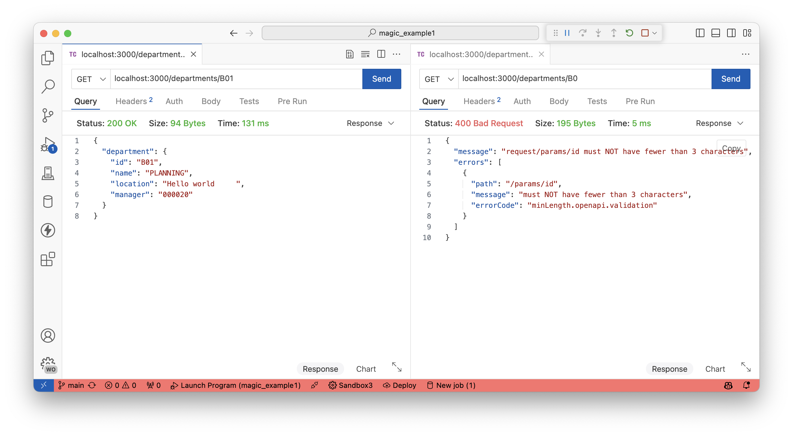

<Aside type="note">
Perhaps after adding the validator some of your API calls are no longer working, or are returning errors. This is a good thing! It means that the validator is working and that your API is not matching the specification. You can now go back and fix the API to match the specification.
</Aside>